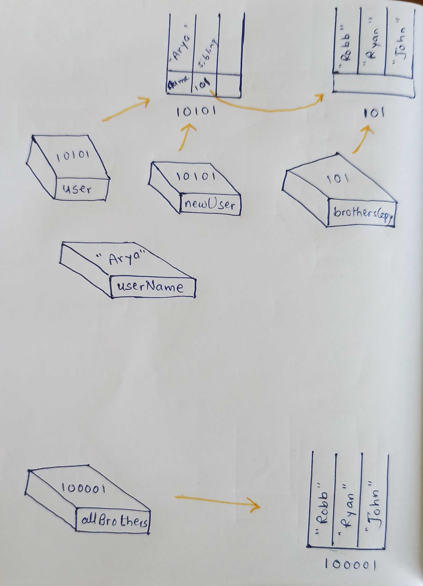

```js
let user = {
  name: 'Arya',
  sibling: ['Robb', 'Ryan', 'John'],
};
let allBrothers = ['Robb', 'Ryan', 'John'];
let brothersCopy = user.sibling;
let username = user.name;
let newUser = user;
```

1. Memory representation

- Create the memory representation of the above snippet on notebook.
- Take a photo/screenshot and add it to the folder `code`

<!-- To add this image here use  -->
.

2. Answer the following with reason:

- `user == newUser;` // true, because both the variable referencing the same object.
- `user === newUser;`// true, because both the variable referencing the same object.
- `user.name === newUser.name;`// true, user.name has reference of that perticular object and newUser.name is also that part of object.
- `user.name == newUser.name;`// true, user.name has reference of that perticular object and newUser.name is also that part of object.
- `user.sibling == newUser.sibling;`// true here both variable referancing same part of same object.
- `user.sibling === newUser.sibling;`// true here both variable referancing same part of same object.
- `user.sibling == allBrothers;`// false both the variable referencing two different object(allBrother is Array and array is special type of object).
- `user.sibling === allBrothers;`// false both the variable referencing two different object(allBrother is Array and array is special type of object).
- `brothersCopy === allBrothers;`// false both the variable referencing two different object(allBrother is Array and array is special type of object).
- `brothersCopy == allBrothers;`// false both the variable referencing two different object(allBrother is Array and array is special type of object).
- `brothersCopy == user.sibling;`// true, because both the variable allBrothers and user.sibling referencing the same object.
- `brothersCopy === user.sibling;`// true, because both the variable allBrothers and user.sibling referencing the same object.
- `brothersCopy[0] === user.sibling[0];`// true, because both the variable allBrothers and user.sibling referencing first value of the same object.
- `brothersCopy[1] === user.sibling[1];`// true, because both the variable allBrothers and user.sibling referencing second value of the same object.
- `user.sibling[1] === newUser.sibling[1];`// true, because both the variable newUser.sibling and user.sibling referencing second value of the same object.
