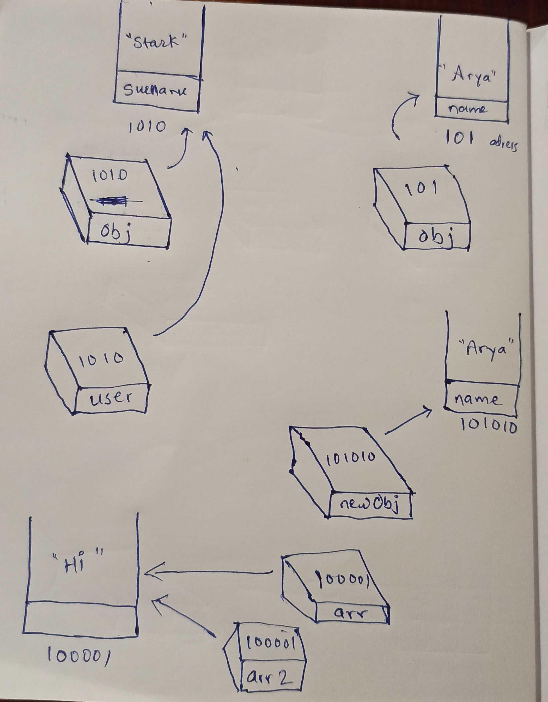

1. What will be the output and explain the reason.

```js
let obj = { name: 'Arya' };
obj = { surname: 'Stark' };
let newObj = { name: 'Arya' };
let user = obj;
let arr = ['Hi'];
let arr2 = arr;
```

Answer the following with reason after going through the above code:

- `[10] === [10]` // false =  Here first array is on other address and second array is on other address
- What is the value of obj? // { surname: 'Stark' }
- `obj == newObj`// false = At line no 5 address of object is changed, so now newObj hase different address and obj has different.
- `obj === newObj`// false = At line no 5 address of object is changed, so now newObj hase different address and obj has different.
- `user === newObj` // false = user has value of obj and obj and newObj are having different values.
- `user == newObj` // false = user has value of obj and obj and newObj are having different values.
- `user == obj` // true = both has same address.
- `arr == arr2` // true = both has same address.
- `arr === arr2` // true = both has same address.

2. What's will be the value of `person1` and `person2` ? Explain with reason. Draw the memory representation diagram.

<!-- To add this image here use  -->


let name = "sandip";

name = "Abhijeet";


```js
function personDetails(person) {
  person.age = 25;
  person = { name: 'John', age: 50 };
  return person;
}
var person1 = { name: 'Alex', age: 30 }; // this creating new variable of person1 so has its own element;
var person2 = personDetails(person1); // person2 variable get reference from personDetails(person) and gets its value;
console.log(person1);
console.log(person2);
```

3. What will be the output of the below code:

```js
var brothers = ['Bran', 'John'];
var user = {
  name: 'Sansa',
};
user.brothers = brothers;
brothers.push('Robb');
console.log(user.brothers === brothers); // true
console.log(user.brothers.length === brothers.length); // true 
```
